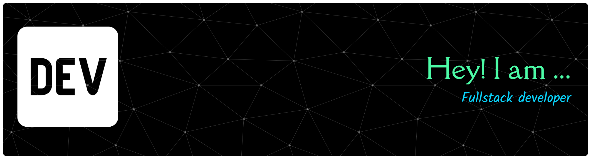

  

 

<h1 align="center">नमस्ते 🙏, I'm Amit Baghla</h1>

  <em>A passionate Frontend Developer from Suratgarh, Rajasthan 🇮🇳</em>

&nbsp;

---

### 👨‍💻 About Me

- 🌱 &nbsp; Fresher developer sharpening my skills every day
- ⚡ &nbsp; Currently building projects with **Next.js & TypeScript**
- 🏜️ &nbsp; From the desert lands of **Suratgarh, Rajasthan**
- 💬 &nbsp; Ask me about **React, Next.js, Tailwind CSS**
- 🎯 &nbsp; Goal: Land my first dev job and keep building cool stuff

---

### 🛠️ Tech Stack

---

### 📊 GitHub Stats

 
  

 

  

---

### 🔗 Connect with Me

---

  <em>"Code. Learn. Repeat."</em>

